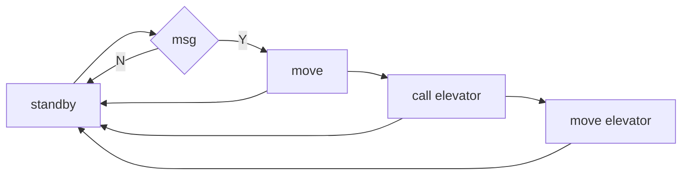
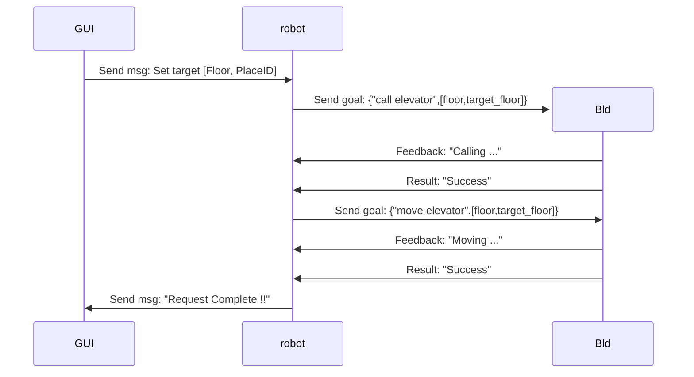
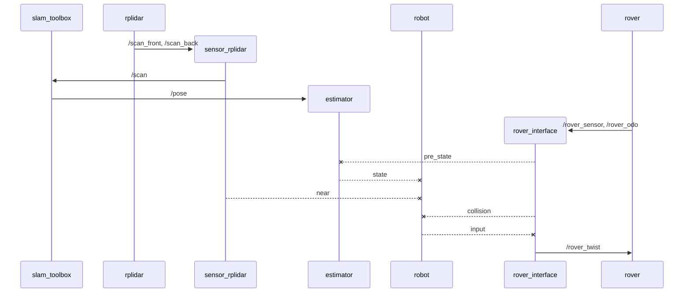

# Robot friendly building

クラス分けの原則
- できてないー＞各クラスは閉じる： __init__ 以外ではpub/sub を除き他のクラスやrobotにアクセスしない
- できてないー＞クラスをまたぐ処理はrobot_nodeで　　例：衝突回避＝動く量算出(controller) + 環境計測(sensor)

## TODO
各種整理
- namespace としてホスト名べた書きを止める
- コメントアウト整理
- ~~Switchbot MAC ADDRESS~~

## Setup

Follow [acsl install and Usage chapter](https://github.com/acsl-tcu/acsl).

### setup Robot

```bash
mkdir robot
cd robot
acsl init rf 87 robot
./1_launcher/build_robot
```

### setup Building

```bash
mkdir bld
cd bld
acsl init rf 87 building
(acsl install switchbot)
(acsl install vl53l1x)
./1_launcher/build_building
```


## Usage (Manual execute)

### run Robot

```bash
acsl robot
dup all
```

### run Building

```bash
acsl bld
dup all
```

### Autorun

```bash
acsl autorun
```

## Robot: Status flow 



## Msg Action diagram




以下の図では上段に並んでいるブロックがノードを、途中から現れるブロックとしてノード内のクラスを表す。矢印がノード間のトピック通信を破線がクラスを介した情報の伝達を表す。


## 動作確認

1. slamでオドメトリが更新できるか。

まずimageがちゃんとそろっているか確認

```bash
dimages
```

でimage_rf_robot, rplidar, microros, slam_toolbox 
が必要です。なければ以下で入れてください。

```bash
dpull IMAGE_NAME
```

IMAGE_NAMEは足りていないイメージ
次にノードを立ち上げます。

```bash
drm all
dup all
```

これでrplidar_front/behind, rf_robot, microros, slam_toolboxが立ち上がることを確認し、以下で具体的に動いていることを確認していきます。

```bash
rtopic info /scan
rtopic info /odom
```

でsub/pubが１つ筒になっていることを確認し、slam_toolboxにちゃんとtopicが渡せる状態か確認。

```bash
rtopic echo /scan
```

これでrplidar情報が送られているか確認。（現状は簡単のためfrontのみの情報を送っている。）

```bash
rtopic info /pose
```

同様にpub/sub確認しslam_toolboxから推定状態が得られているか確認。
最後に以下コマンドでログを見ながら手動で動かすことでログのCurrentの最後にある３つの状態が変化するか確認

```bash
dlogs rf_robot
```

これでslam_toolboxで自己位置推定ができているかが確認できる。
推定結果がおおよそ正しいことを確認してください。

2. rf_robotからのrover_twist でローバーが動かせるか

１の確認の後、原点に戻してから以下を実行

```bash 
drm all
dup all
dlogs rf_robot
```

ローバーが動き出すのでタイヤを浮かして以下を実行
別ターミナルを立ち上げ

```bash
acsl robot
Dcmd "ros2 topic pub --once /Robot1/console2robot std_msgs/msg/Int8MultiArray '{data: [1, 1]}' --qos-durability volatile --qos-depth 1"
```

これでrf_robotのログのnan,nan になっていたGoalが適切に設定され、ローバーが動き出すか確認。
動くタイヤの向きがおかしくないか確認してください。
3. 上記二つを合わせる。
原点に戻し
drm all
dup all
コントローラで非常停止できる状態で別ターミナルを開き
acsl robot
Dcmd "ros2 topic pub --once /Robot1/console2robot std_msgs/msg/Int8MultiArray '{data: [1, 1]}' --qos-durability volatile --qos-depth 1"
で走行実験をおこなう。
プログラムを止めるのはdrm allで止まるが、ローバーが止まるかどうかはローバーのプログラム次第。
止まらなければ以下停止topicを送る
Dcmd "ros2 topic pub /rover_twist geometry_msgs/msg/Twist '{linear: {x: 0.0, y: 0.0, z: 0.0}, angular: {x: 0.0, y: 0.0, z: 0.0}}'"
